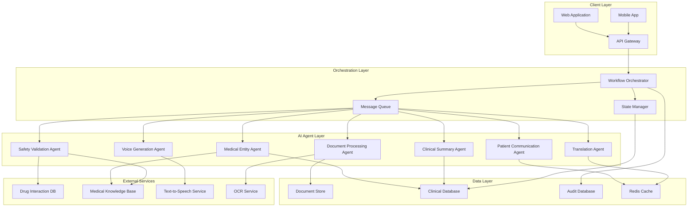

# Design Document: Agentic Clinical Workflow Copilot

## Overview

The Agentic Clinical Workflow Copilot is a cloud-native, multi-agent AI system designed to orchestrate clinical workflows with a focus on discharge processes. The system employs a microservices architecture on AWS, utilizing specialized AI agents for document processing, medical entity extraction, safety validation, and patient communication generation. The design emphasizes safety, transparency, and human oversight while providing scalable, reliable clinical workflow automation.

The system processes clinical documents through a series of AI agents, each responsible for specific clinical tasks. A central orchestration engine coordinates agent interactions, maintains workflow state, and ensures proper human approval checkpoints. All processing maintains complete audit trails and provides transparent reasoning for clinical decision support.

## High Level Architecture



## Major Components

### 1. Workflow Orchestrator
**Purpose**: Central coordination engine that manages multi-agent workflows and maintains clinical process integrity.

**Responsibilities**:
- Coordinates agent execution sequences
- Manages workflow state transitions
- Enforces approval checkpoints
- Handles error recovery and retry logic
- Maintains workflow timing and SLA monitoring

**Technology**: AWS Step Functions with custom Lambda orchestration logic

### 2. Document Processing Agent
**Purpose**: Handles clinical document ingestion, validation, and initial processing.

**Responsibilities**:
- Document format validation and conversion
- OCR processing for scanned documents
- Document classification and routing
- Metadata extraction and indexing
- Quality assessment and error flagging

**Technology**: AWS Lambda with Amazon Textract integration

### 3. Medical Entity Extraction Agent
**Purpose**: Extracts structured medical information from unstructured clinical documents.

**Responsibilities**:
- Named entity recognition for medical terms
- Medication, diagnosis, and procedure extraction
- Confidence scoring for extracted entities
- Conflict detection across multiple documents
- Medical terminology standardization

**Technology**: AWS Comprehend Medical with custom NLP models

### 4. Safety Validation Agent
**Purpose**: Performs clinical safety checks and risk assessment on extracted medical data.

**Responsibilities**:
- Drug interaction checking
- Dosage validation against patient parameters
- Allergy cross-referencing and contraindication detection
- Age-appropriate medication validation
- Critical value flagging and alert generation
- Risk stratification scoring

**Technology**: AWS Lambda with external drug interaction databases and clinical decision support systems

### 5. Clinical Summary Agent
**Purpose**: Generates comprehensive discharge summaries and clinical documentation.

**Responsibilities**:
- Structured discharge summary generation
- Clinical narrative synthesis from multiple sources
- Care plan consolidation and formatting
- Follow-up instruction compilation
- Provider handoff documentation

**Technology**: Large Language Model with clinical fine-tuning on AWS Bedrock

### 6. Patient Communication Agent
**Purpose**: Creates patient-friendly explanations and instructions from clinical documentation.

**Responsibilities**:
- Medical jargon simplification
- Patient education material generation
- Care instruction formatting for lay audiences
- Health literacy level adaptation
- Visual aid and diagram suggestions

**Technology**: Specialized LLM with patient communication training

### 7. Translation Agent
**Purpose**: Translates patient instructions into Indian regional languages with medical accuracy.

**Responsibilities**:
- Multi-language translation (Hindi, Tamil, Telugu, Bengali, Marathi, Gujarati)
- Medical terminology preservation
- Cultural context adaptation
- Regional dialect considerations
- Translation quality validation

**Technology**: AWS Translate with custom medical terminology dictionaries

### 8. Voice Generation Agent
**Purpose**: Converts written patient instructions into natural-sounding audio in multiple languages.

**Responsibilities**:
- Text-to-speech conversion with medical pronunciation
- Multi-language voice synthesis
- Audio quality optimization
- Pronunciation accuracy for medical terms
- Audio file format management

**Technology**: AWS Polly with custom medical pronunciation lexicons

### 9. State Manager
**Purpose**: Maintains workflow state and ensures data consistency across agent interactions.

**Responsibilities**:
- Workflow state persistence
- Agent result aggregation
- Version control for document iterations
- Rollback and recovery mechanisms
- State synchronization across distributed components

**Technology**: AWS DynamoDB with event sourcing patterns

### 10. Audit and Compliance System
**Purpose**: Maintains complete audit trails and ensures regulatory compliance.

**Responsibilities**:
- Complete workflow logging
- User action tracking
- Data access monitoring
- Compliance report generation
- Security event detection

**Technology**: AWS CloudTrail with custom audit logging

## Data Models

### Clinical Document
```json
{
  "documentId": "string",
  "patientId": "string",
  "documentType": "discharge_summary|lab_report|prescription|imaging_report",
  "uploadTimestamp": "ISO8601",
  "originalFormat": "pdf|image|text",
  "processingStatus": "uploaded|processing|completed|failed",
  "extractedEntities": {
    "medications": [
      {
        "name": "string",
        "dosage": "string",
        "frequency": "string",
        "duration": "string",
        "confidence": "number"
      }
    ],
    "diagnoses": [
      {
        "code": "string",
        "description": "string",
        "confidence": "number"
      }
    ],
    "procedures": [
      {
        "code": "string",
        "description": "string",
        "date": "ISO8601",
        "confidence": "number"
      }
    ]
  },
  "safetyFlags": [
    {
      "type": "drug_interaction|allergy|dosage_error",
      "severity": "low|medium|high|critical",
      "description": "string",
      "recommendation": "string"
    }
  ]
}
```

### Workflow State
```json
{
  "workflowId": "string",
  "patientId": "string",
  "currentStage": "document_processing|entity_extraction|safety_validation|summary_generation|patient_communication|clinician_review|completed",
  "startTime": "ISO8601",
  "lastUpdated": "ISO8601",
  "agentResults": {
    "documentProcessing": {
      "status": "completed|failed|in_progress",
      "confidence": "number",
      "extractedText": "string",
      "documentCount": "number"
    },
    "entityExtraction": {
      "status": "completed|failed|in_progress",
      "medicationCount": "number",
      "diagnosisCount": "number",
      "overallConfidence": "number"
    },
    "safetyValidation": {
      "status": "completed|failed|in_progress",
      "flagCount": "number",
      "criticalFlags": "number",
      "riskScore": "number"
    }
  },
  "clinicianReview": {
    "required": "boolean",
    "completed": "boolean",
    "reviewerId": "string",
    "reviewTimestamp": "ISO8601",
    "approvalStatus": "approved|rejected|needs_revision",
    "comments": "string"
  }
}
```

### Patient Communication Package
```json
{
  "packageId": "string",
  "patientId": "string",
  "language": "en|hi|ta|te|bn|mr|gu",
  "dischargeSummary": {
    "simplified": "string",
    "keyInstructions": ["string"],
    "medications": [
      {
        "name": "string",
        "instructions": "string",
        "warnings": ["string"]
      }
    ],
    "followUpCare": {
      "appointments": ["string"],
      "warningSignsToWatch": ["string"],
      "emergencyContacts": ["string"]
    }
  },
  "audioInstructions": {
    "mainInstructions": "s3://bucket/audio-file.mp3",
    "medicationInstructions": "s3://bucket/medication-audio.mp3",
    "followUpInstructions": "s3://bucket/followup-audio.mp3"
  },
  "generationTimestamp": "ISO8601",
  "approvalStatus": "pending|approved|rejected"
}
```

## API Design

### Core Endpoints

#### POST /api/v1/workflows
**Purpose**: Initiate a new clinical workflow
**Request**:
```json
{
  "patientId": "string",
  "documents": [
    {
      "file": "base64_encoded_content",
      "filename": "string",
      "contentType": "string"
    }
  ],
  "workflowType": "discharge|medication_review|clinical_summary",
  "priority": "low|normal|high|urgent",
  "requestedLanguages": ["en", "hi", "ta"]
}
```
**Response**:
```json
{
  "workflowId": "string",
  "status": "initiated",
  "estimatedCompletionTime": "ISO8601",
  "trackingUrl": "string"
}
```

#### GET /api/v1/workflows/{workflowId}
**Purpose**: Get workflow status and results
**Response**:
```json
{
  "workflowId": "string",
  "status": "processing|completed|failed|requires_review",
  "currentStage": "string",
  "progress": "number",
  "results": {
    "dischargeSummary": "string",
    "patientInstructions": "string",
    "safetyFlags": ["object"],
    "audioInstructions": ["string"]
  },
  "requiresClinicianReview": "boolean",
  "estimatedCompletionTime": "ISO8601"
}
```

#### POST /api/v1/workflows/{workflowId}/review
**Purpose**: Submit clinician review and approval
**Request**:
```json
{
  "reviewerId": "string",
  "action": "approve|reject|request_revision",
  "comments": "string",
  "modifications": {
    "dischargeSummary": "string",
    "patientInstructions": "string",
    "medications": ["object"]
  }
}
```

#### GET /api/v1/workflows/{workflowId}/audit
**Purpose**: Retrieve complete audit trail
**Response**:
```json
{
  "workflowId": "string",
  "auditTrail": [
    {
      "timestamp": "ISO8601",
      "agent": "string",
      "action": "string",
      "input": "object",
      "output": "object",
      "confidence": "number",
      "processingTime": "number"
    }
  ],
  "userActions": [
    {
      "timestamp": "ISO8601",
      "userId": "string",
      "action": "string",
      "details": "object"
    }
  ]
}
```

## Security and Compliance

### Data Protection
- **Encryption**: All data encrypted at rest using AWS KMS with customer-managed keys
- **Transit Security**: TLS 1.3 for all API communications
- **Access Control**: Role-based access control (RBAC) with principle of least privilege
- **Data Residency**: Patient data stored within specified geographic boundaries
- **Retention Policies**: Automated data lifecycle management with configurable retention periods

### HIPAA Compliance
- **Business Associate Agreements**: Established with all third-party services
- **Audit Logging**: Complete audit trails for all data access and modifications
- **Access Controls**: Multi-factor authentication for all clinical users
- **Data Minimization**: Only necessary data processed and stored
- **Breach Notification**: Automated breach detection and notification systems

### Clinical Safety
- **Human Oversight**: Mandatory clinician review for all patient-facing outputs
- **Confidence Thresholds**: Configurable confidence levels for automated processing
- **Fallback Mechanisms**: Manual processing paths for low-confidence results
- **Error Handling**: Graceful degradation with clear error reporting
- **Version Control**: Complete versioning of all clinical outputs

## Scalability and Performance

### Performance Requirements
- **Document Processing**: < 30 seconds for standard discharge documents
- **Entity Extraction**: < 10 seconds for typical clinical documents
- **Safety Validation**: < 5 seconds for medication reconciliation
- **Translation**: < 15 seconds per language
- **Voice Generation**: < 20 seconds per audio file
- **End-to-End Workflow**: < 5 minutes for complete discharge workflow

### Scalability Design
- **Horizontal Scaling**: Auto-scaling groups for all compute components
- **Load Balancing**: Application Load Balancer with health checks
- **Database Scaling**: Read replicas and connection pooling
- **Caching Strategy**: Multi-layer caching with Redis and CloudFront
- **Queue Management**: SQS with dead letter queues for reliability

### Monitoring and Observability
- **Application Metrics**: Custom CloudWatch metrics for clinical workflows
- **Performance Monitoring**: X-Ray tracing for end-to-end visibility
- **Health Checks**: Comprehensive health monitoring for all components
- **Alerting**: PagerDuty integration for critical system alerts
- **Dashboards**: Real-time operational dashboards for clinical staff

## Deployment and Operations

### Infrastructure as Code
- **AWS CDK**: Complete infrastructure definition in TypeScript
- **Environment Management**: Separate stacks for dev, staging, and production
- **Configuration Management**: AWS Systems Manager Parameter Store
- **Secrets Management**: AWS Secrets Manager with automatic rotation

### CI/CD Pipeline
- **Source Control**: Git-based workflow with feature branches
- **Build Process**: AWS CodeBuild with automated testing
- **Deployment**: Blue-green deployments with automatic rollback
- **Testing**: Comprehensive test suite including integration and load tests
- **Quality Gates**: Automated security scanning and compliance checks

### Disaster Recovery
- **Backup Strategy**: Automated daily backups with point-in-time recovery
- **Multi-AZ Deployment**: High availability across multiple availability zones
- **Cross-Region Replication**: Critical data replicated to secondary region
- **Recovery Time Objective**: < 4 hours for complete system recovery
- **Recovery Point Objective**: < 15 minutes data loss tolerance

## Integration Points

### Electronic Health Records (EHR)
- **HL7 FHIR**: Standard healthcare data exchange format
- **API Integration**: RESTful APIs for bidirectional data exchange
- **Real-time Sync**: Event-driven synchronization with EHR systems
- **Data Mapping**: Configurable field mapping for different EHR vendors

### Hospital Information Systems
- **ADT Integration**: Admission, Discharge, Transfer system connectivity
- **Laboratory Systems**: Integration with lab result systems
- **Pharmacy Systems**: Medication verification and dispensing integration
- **Imaging Systems**: DICOM integration for medical imaging

### External Medical Databases
- **Drug Interaction Databases**: Real-time drug interaction checking
- **Medical Knowledge Bases**: Access to current medical literature
- **Clinical Decision Support**: Integration with evidence-based guidelines
- **Regulatory Databases**: FDA drug information and safety alerts

## Testing Strategy

### Unit Testing
- **Agent Testing**: Individual agent functionality validation
- **API Testing**: Comprehensive endpoint testing with mock data
- **Data Model Testing**: Schema validation and data integrity checks
- **Security Testing**: Authentication and authorization validation

### Integration Testing
- **Workflow Testing**: End-to-end workflow validation
- **External Service Testing**: Third-party integration testing
- **Database Testing**: Data persistence and retrieval validation
- **Performance Testing**: Load testing under realistic conditions

### Clinical Validation Testing
- **Medical Accuracy**: Clinical expert review of AI outputs
- **Safety Testing**: Validation of safety flag accuracy
- **Language Testing**: Translation accuracy verification
- **Usability Testing**: Clinical user interface testing

### Property-Based Testing Framework
The system will implement property-based testing to validate correctness properties across the clinical workflow:

**Testing Framework**: fast-check (JavaScript/TypeScript property-based testing library)

**Core Properties to Test**:
1. **Document Processing Completeness**: All uploaded documents are processed and no data is lost
2. **Entity Extraction Consistency**: Extracted medical entities maintain consistency across document versions
3. **Safety Flag Reliability**: Critical safety issues are always flagged regardless of input variations
4. **Translation Preservation**: Medical meaning is preserved across all language translations
5. **Audit Trail Completeness**: Every workflow action is logged with complete traceability
6. **Human Review Enforcement**: Patient-facing outputs are never released without clinician approval

**Property Test Implementation**:
- Generate diverse clinical document inputs with known expected outputs
- Validate that safety-critical properties hold across all input variations
- Test edge cases and boundary conditions automatically
- Ensure system behavior remains consistent under load and failure conditions

## Correctness Properties

### 1. Document Processing Completeness Property
**Property**: For any set of valid clinical documents uploaded to the system, all documents must be successfully processed and their content extracted without data loss.

**Formal Specification**: 
```
∀ documents D, processing_result P:
  process(D) = P → 
    (∀ d ∈ D: d.content ⊆ P.extracted_content) ∧
    (P.status = "completed" ∨ P.status = "failed_with_reason")
```

**Validates**: Requirements 1.1, 1.2, 1.3

### 2. Safety Flag Reliability Property
**Property**: Critical drug interactions and safety issues must always be detected and flagged, regardless of document format or input variations.

**Formal Specification**:
```
∀ medication_list M, patient_profile P:
  has_critical_interaction(M, P) = true →
    safety_validation(M, P).critical_flags.length > 0
```

**Validates**: Requirements 2.1, 2.2, 2.3

### 3. Human Review Enforcement Property
**Property**: No patient-facing output can be released without explicit clinician approval.

**Formal Specification**:
```
∀ workflow W, patient_output O:
  generate_patient_output(W) = O →
    O.release_status = "pending" ∧
    (O.released = true → ∃ clinician_approval A: A.approved = true ∧ A.output_id = O.id)
```

**Validates**: Requirements 3.1, 3.2

### 4. Translation Accuracy Property
**Property**: Medical terminology and critical instructions must be preserved accurately across all supported language translations.

**Formal Specification**:
```
∀ medical_text T, language L, critical_terms CT:
  translate(T, L) = T' →
    (∀ term ∈ CT: medical_meaning(term, T) = medical_meaning(translate(term, L), T'))
```

**Validates**: Requirements 4.1, 4.2

### 5. Audit Trail Completeness Property
**Property**: Every action in the clinical workflow must be logged with complete traceability and timestamps.

**Formal Specification**:
```
∀ workflow_action A, timestamp T:
  execute_action(A, T) →
    ∃ audit_entry E: E.action = A ∧ E.timestamp = T ∧ E.user_id ≠ null
```

**Validates**: Requirements 5.1, 5.2

## Risk Mitigation

### Clinical Risks
- **Misdiagnosis Prevention**: No diagnostic capabilities, only documentation assistance
- **Medication Errors**: Multiple validation layers with human oversight
- **Communication Failures**: Simplified language with clinician review
- **Legal Liability**: Clear disclaimers and human approval requirements

### Technical Risks
- **System Downtime**: Multi-AZ deployment with automatic failover
- **Data Loss**: Comprehensive backup and replication strategy
- **Security Breaches**: Defense-in-depth security architecture
- **Performance Degradation**: Auto-scaling and performance monitoring

### Operational Risks
- **User Adoption**: Comprehensive training and change management
- **Integration Failures**: Extensive testing with partner systems
- **Compliance Violations**: Automated compliance monitoring and reporting
- **Vendor Dependencies**: Multi-vendor strategy and exit planning

This design provides a comprehensive foundation for building a safe, scalable, and effective clinical workflow automation system that maintains human oversight while significantly reducing documentation burden for healthcare providers.